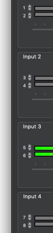

[LadioCast](http://blog.kawauso.com/ladiocast) Version 0.13.0 has been released on [MAS](https://itunes.apple.com/app/ladiocast/id411213048).

Changes from version 0.12.6 to 0.13.0 are as follows:

* Removed the ability to pan input stereo channels.
* Enabled to map any input channel of multi-channel audio devices into stereo.

You will see the input channels selectable at the following part of the mixer window;

.

Bye.
