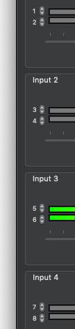

[LadioCast](http://blog.kawauso.com/ladiocast) バージョン0.13.0が [MAS](https://itunes.apple.com/app/ladiocast/id411213048) でリリースされています。

バージョン0.12.6から0.13.0への変更は次のとおりです。

* 入力のステレオチャンネルを個々にパンできる機能を削除
* マルチチャンネルオーディオデバイスの任意の入力チャンネルをステレオにマッピングできる機能を追加

ミキサーウィンドウの次の部分で、選択可能な入力チャネルが表示されます。

では。
